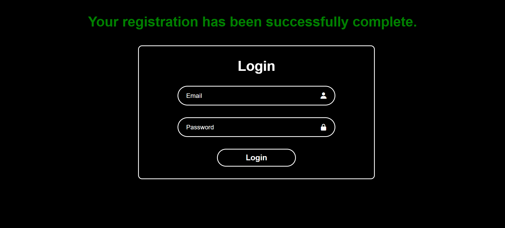

# Gym Management System

Welcome to the Gym Management System project! This repository contains the code and documentation for managing gym memberships, plans, and user details.

## Description

The Gym Management System is designed to help gym administrators manage memberships, plans, and user information efficiently. It includes features for registering new members, selecting and managing plans, and viewing user details.

## Features

- Memeber Registration
- Plan Selection
- Reporting
- View Registration Receipt

## Technologies Used

- **Frontend**: HTML, CSS, JavaScript
- **Backend**: Node.js, Express.js
- **Database**: MongoDB (or your choice of database)
- **Authentication**: [Authentication method] (e.g., JWT, OAuth)

## Screenshots

To provide a better understanding of the Gym Management System application, here is a screenshot:

##Main Interface

##About Interface

##Services Interface

##Join Interface

##Login Interface

##Connected Interface

##Receipt Interface

Feel free to customize this template according to your project's specific needs and details!

For any inquiries, please contact:

Name: Gauranshi Varshney
Email: gauranshivarshney@gmail.com
